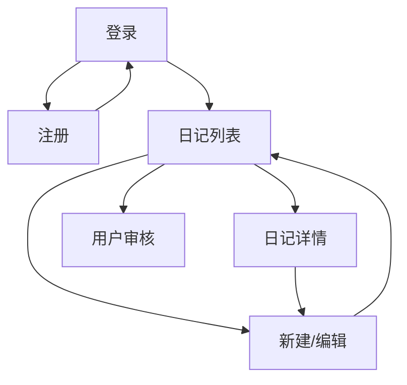

# 02 — 产品原型说明

> 高保真可交互原型：[`prototype/index.html`](./prototype/index.html)  
> **主场景以手机为准**；桌面端为同一套视觉的自适应布局。

## 1. 设计原则

| 原则 | 说明 |
|------|------|
| 手机优先 | 日常录入与查阅在鸿蒙手机完成，触控热区 ≥ 44px |
| 高保真 | 含状态栏、底部 Tab、筛选抽屉、真实字段与配色 |
| 自适应 | ≤480px 全屏 App；桌面用手机画框预览或宽屏侧栏布局 |
| 品牌 | 「复盘日记」青绿主色 + 衬线标题，避免通用紫/奶油模板感 |
| A股配色 | 红涨绿跌 |

## 2. 信息架构

## 3. 页面清单（高保真）

| 页面 | 原型文件 | 正式路由 |
|------|----------|----------|
| 导航首页 | [index.html](./prototype/index.html) | — |
| 登录 | [login.html](./prototype/login.html) | `/login` |
| 注册 | [register.html](./prototype/register.html) | `/register` |
| 日记列表（主） | [mobile-diary-list.html](./prototype/mobile-diary-list.html) | `/` |
| 日记详情 | [diary-detail.html](./prototype/diary-detail.html) | `/entries/:id` |
| 新建/编辑 | [diary-edit.html](./prototype/diary-edit.html) | `/entries/new` |
| 用户审核 | [admin.html](./prototype/admin.html) | `/admin/users` |
| 桌面宽屏 | [diary-list-desktop.html](./prototype/diary-list-desktop.html) | `/`（≥768px） |

### 3.1 登录 / 注册

- 品牌首屏：圆形品牌标 + 「复盘日记」衬线标题
- 大号输入框（16px，避免 iOS 缩放）
- 注册成功：内联成功提示「等待管理员审核」

### 3.2 日记列表（手机主界面）

- 顶栏：仅品牌名（**无「+ 新建」**，避免与底部 Tab 重复）
- 横向筛选 Chip：全部 / 筛选抽屉 / 本周 / 本月 / 代码快捷
- 按日分组；标题加粗；股票显示「代码 + 名称」；红绿盈亏
- 底部 Tab：日记 / **写复盘**（唯一新建入口）/ 管理
- PWA 横幅：添加到桌面
- 筛选 Sheet：日期范围 + 股票代码库搜索

### 3.3 新建 / 编辑

- 标题输入即时加粗
- 结构化：**日期 → 自动大盘概况、当日/总盈亏、情绪（表情）**
- **大盘概况**：可折叠卡片，**默认收起**；标题旁 ▶ 展开；收起时一行摘要（上证涨跌、涨跌家数、资金）
- **已去掉**：评分、标签、顶栏保存、手动选股控件
- **正文内股票自动标签化**：输入 `600519` 等匹配代码库的代码 → 自动变成行内标签（含名称）；底部只读展示「自动识别」列表供查询
- **正文**：工具栏 B / I / 列表 / 插图 均作用于框内光标处
  - 「列表」→ 光标处项目符号
  - 「插图」→ **先点正文定位，再插图**，插在该位置
- **仅底部**「保存复盘」

### 3.4 详情

- 标题区渐变底 + 加粗大标题
- 元信息：股票、**当日盈亏 / 总盈亏**、情绪（表情）
- **无顶栏「编辑」**；底部「编辑 / 删除」

### 3.5 管理员审核

- Segmented：待审核 / 已通过 / 已拒绝
- 用户卡片：通过 / 拒绝

### 3.6 桌面自适应

- ≥768px：侧栏筛选 + 卡片网格；顶栏一个「写复盘」
- ＜768px：隐藏侧栏
- ≤480px：全宽铺满

## 4. 视觉规范

| Token | 值 |
|-------|-----|
| 主色 brand | `#0d7377` |
| 背景 bg | `#f2f6f4` |
| 文字 ink | `#0f1c24` |
| 涨 / 亏 | `#e11d48` / `#059669` |
| 标题字体 | Noto Serif SC |
| 正文字体 | Noto Sans SC |
| 圆角 | 14px（卡片）/ 12px（输入） |
| 主按钮高度 | 48px |

## 5. 关键交互

| 场景 | 行为 |
|------|------|
| 注册成功 | 表单隐藏，显示等待审核提示 |
| 待审核登录 | 红色错误条（原型可注释切换） |
| 打开筛选 | 底部 Sheet 上滑 |
| 删除日记 | `confirm` 二次确认 |
| 选股 | 正文输入代码 → 自动标签化；无手动选股 |
| PWA | 横幅可关闭 |

## 6. 如何预览

1. 浏览器打开 [`prototype/index.html`](./prototype/index.html)
2. **手机**：直接打开；或用 Chrome 设备模拟器选华为机型
3. **桌面**：主页面右侧有说明；另开「桌面宽屏布局」看侧栏自适应
