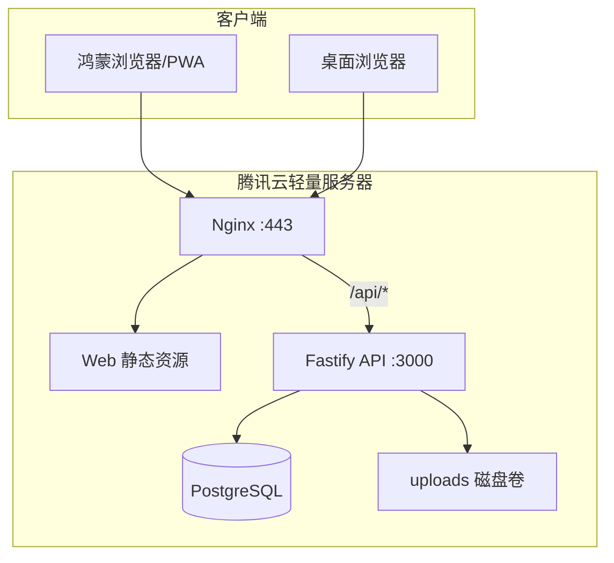
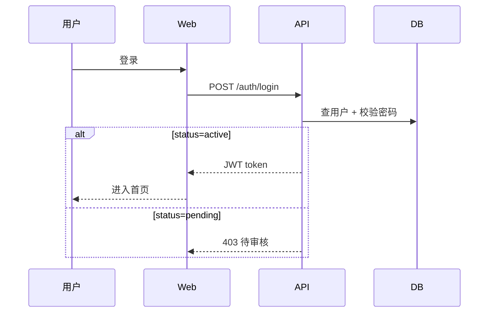

# 03 — 技术架构

## 1. 技术栈

| 层级 | 技术 | 版本建议 |
|------|------|----------|
| 前端框架 | React + TypeScript | React 18 |
| 构建 | Vite | 5.x |
| 路由 | React Router | 6.x |
| 富文本 | TipTap | 2.x |
| PWA | vite-plugin-pwa | Workbox |
| HTTP 客户端 | fetch / axios | — |
| 后端框架 | Fastify | 4.x |
| ORM | Prisma | 5.x |
| 数据库 | PostgreSQL | 16 |
| 鉴权 | JWT + bcrypt | — |
| 反向代理 | Nginx | alpine |
| 容器 | Docker Compose | v2 |

## 2. 系统架构



## 3. 目录结构

```
笔记/
├── apps/
│   ├── web/                 # 前端 PWA
│   │   ├── src/
│   │   │   ├── pages/       # 页面组件
│   │   │   ├── components/  # 通用组件
│   │   │   ├── api/         # API 封装
│   │   │   └── hooks/       # 鉴权等 hooks
│   │   ├── public/
│   │   └── vite.config.ts
│   └── api/                 # 后端
│       ├── src/
│       │   ├── routes/      # 路由模块
│       │   ├── plugins/     # JWT 等插件
│       │   └── seed.ts      # 管理员种子
│       └── prisma/
│           └── schema.prisma
├── nginx/
│   └── default.conf
├── docs/                    # 本文档与原型
├── docker-compose.yml
├── .env.example
└── README.md
```

## 4. 鉴权流程



- JWT 存 `localStorage`，请求头 `Authorization: Bearer <token>`
- Token 有效期 7 天，过期重新登录
- 管理员路由后端二次校验 `role === admin`

## 5. 图片存储

首版：本地文件系统

```
uploads/
  └── {userId}/
      └── {uuid}.jpg
```

- Nginx 将 `/uploads/*` 反向代理到 API 静态服务
- 后续迁移 COS：仅需替换 upload handler，正文 URL 前缀变更

## 6. PWA 策略

- `manifest.json`：名称、图标、主题色、`display: standalone`
- Service Worker：缓存静态资源壳；API 请求 network-first
- 鸿蒙：用户手动「添加到桌面」，无需应用商店

## 7. 安全要点

- 密码 bcrypt（cost 10）
- JWT secret 来自环境变量，≥ 32 字符随机
- 上传校验 MIME + 扩展名 + 大小
- 日记 API 按 `userId` 隔离，用户只能访问自己的数据
- 生产环境强制 HTTPS
