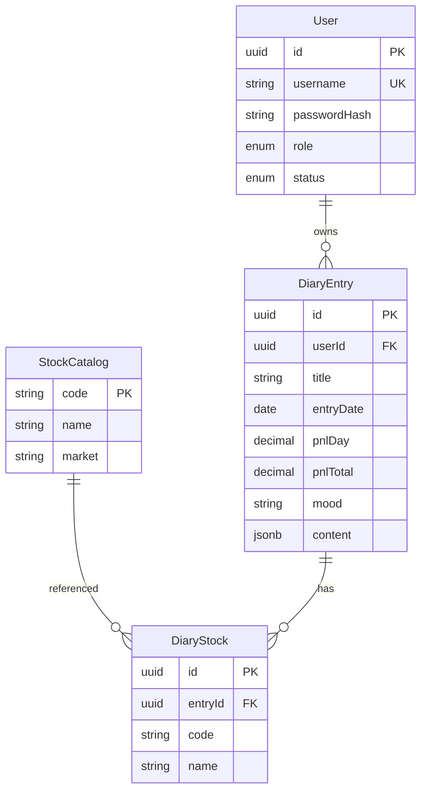

# 05 — 数据库设计

数据库：PostgreSQL 16

## ER 图



## 表定义

### users

| 列 | 类型 | 约束 | 说明 |
|----|------|------|------|
| id | UUID | PK | |
| username | VARCHAR(50) | UNIQUE, NOT NULL | |
| password_hash | VARCHAR(255) | NOT NULL | bcrypt |
| role | ENUM | admin / user | |
| status | ENUM | pending / active / rejected | |
| created_at / updated_at | TIMESTAMPTZ | | |

### diary_entries

| 列 | 类型 | 约束 | 说明 |
|----|------|------|------|
| id | UUID | PK | |
| user_id | UUID | FK | |
| title | VARCHAR(200) | NOT NULL | 标题（展示加粗） |
| entry_date | DATE | NOT NULL | 复盘日期 |
| pnl_day | DECIMAL(12,2) | NULL | 当日盈亏 |
| pnl_total | DECIMAL(12,2) | NULL | 总盈亏 |
| mood | VARCHAR(20) | NULL | calm / anxious / greedy / fearful / other |
| content | JSONB | | TipTap JSON |
| created_at / updated_at | TIMESTAMPTZ | | |

**已去掉**：`rating`、`tags`。

**索引**：`(user_id, entry_date DESC)`

### diary_stocks

日记关联的股票（从代码库选中后冗余存 code + name，避免改名影响历史）

| 列 | 类型 | 说明 |
|----|------|------|
| id | UUID | PK |
| entry_id | UUID | FK → diary_entries |
| code | VARCHAR(16) | 如 600519 |
| name | VARCHAR(64) | 如 贵州茅台 |

**索引**：`(entry_id)`；`(code)` 便于按代码查日记

### stock_catalog（外接代码库）

| 列 | 类型 | 说明 |
|----|------|------|
| code | VARCHAR(16) | PK |
| name | VARCHAR(64) | 证券简称 |
| market | VARCHAR(8) | SH / SZ / BJ / US 等 |

首版可用静态 JSON 导入；搜索 API 按 code/name 模糊匹配。

## Prisma 要点

```prisma
model DiaryEntry {
  id        String       @id @default(uuid())
  userId    String       @map("user_id")
  title     String
  entryDate DateTime     @map("entry_date") @db.Date
  pnlDay    Decimal?     @map("pnl_day") @db.Decimal(12, 2)
  pnlTotal  Decimal?     @map("pnl_total") @db.Decimal(12, 2)
  mood      String?
  content   Json         @default("{}")
  stocks    DiaryStock[]
  // 无 rating / tags
}

model DiaryStock {
  id      String     @id @default(uuid())
  entryId String     @map("entry_id")
  code    String
  name    String
  entry   DiaryEntry @relation(...)
}

model StockCatalog {
  code   String @id
  name   String
  market String
}
```
