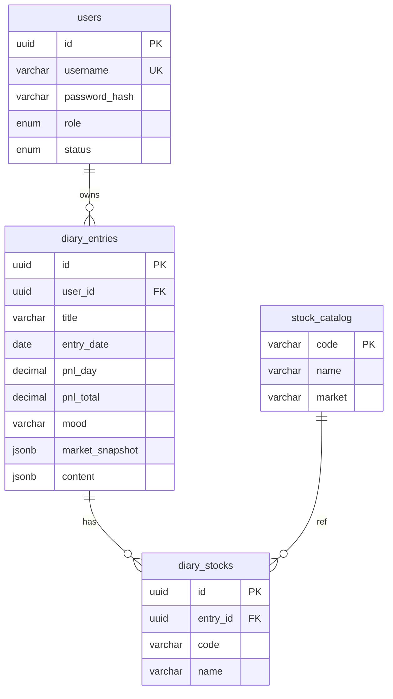

# 数据库设计规范

| 项 | 内容 |
|----|------|
| 引擎 | PostgreSQL 16 |
| ORM | Prisma 5 |
| 字符集 | UTF-8 |
| 时区 | UTC 存储，展示用 Asia/Shanghai |

---

## 1. 命名规范

| 对象 | 规则 | 示例 |
|------|------|------|
| 表名 | snake_case，复数 | `diary_entries` |
| 列名 | snake_case | `entry_date` |
| 主键 | `id` UUID v4 | `gen_random_uuid()` |
| 外键 | `{表名单数}_id` | `user_id` |
| 索引 | `idx_{表}_{列}` | `idx_diary_entries_user_date` |
| 时间戳 | `created_at`, `updated_at` | TIMESTAMPTZ |

---

## 2. 通用字段

每张业务表包含：

- `id` UUID PRIMARY KEY DEFAULT gen_random_uuid()
- `created_at` TIMESTAMPTZ NOT NULL DEFAULT now()
- `updated_at` TIMESTAMPTZ NOT NULL DEFAULT now()

---

## 3. ER 关系



---

## 4. 表结构

### 4.1 users

| 列 | 类型 | 约束 | 说明 |
|----|------|------|------|
| id | UUID | PK | |
| username | VARCHAR(50) | UNIQUE NOT NULL | 登录名 |
| password_hash | VARCHAR(255) | NOT NULL | bcrypt |
| role | user_role | NOT NULL DEFAULT 'user' | admin / user |
| status | user_status | NOT NULL DEFAULT 'pending' | pending / active / rejected |
| created_at | TIMESTAMPTZ | NOT NULL | |
| updated_at | TIMESTAMPTZ | NOT NULL | |

### 4.2 diary_entries

| 列 | 类型 | 约束 | 说明 |
|----|------|------|------|
| id | UUID | PK | |
| user_id | UUID | FK → users.id ON DELETE CASCADE | |
| title | VARCHAR(200) | NOT NULL | |
| entry_date | DATE | NOT NULL | 复盘日期 |
| pnl_day | DECIMAL(12,2) | NULL | 当日盈亏 |
| pnl_total | DECIMAL(12,2) | NULL | 总盈亏 |
| mood | VARCHAR(20) | NULL | calm/anxious/greedy/fearful/other |
| market_snapshot | JSONB | NULL | 见 §5.1 |
| content | JSONB | NOT NULL DEFAULT '{}' | TipTap JSON |
| created_at | TIMESTAMPTZ | NOT NULL | |
| updated_at | TIMESTAMPTZ | NOT NULL | |

**索引**

- `idx_diary_entries_user_date` ON (user_id, entry_date DESC)

### 4.3 diary_stocks

| 列 | 类型 | 约束 | 说明 |
|----|------|------|------|
| id | UUID | PK | |
| entry_id | UUID | FK → diary_entries.id ON DELETE CASCADE | |
| code | VARCHAR(16) | NOT NULL | |
| name | VARCHAR(64) | NOT NULL | 冗余存储 |

**索引**

- `idx_diary_stocks_entry` ON (entry_id)
- `idx_diary_stocks_code` ON (code)

### 4.4 stock_catalog

| 列 | 类型 | 约束 | 说明 |
|----|------|------|------|
| code | VARCHAR(16) | PK | 600519 |
| name | VARCHAR(64) | NOT NULL | 贵州茅台 |
| market | VARCHAR(8) | NOT NULL | SH/SZ/BJ |
| updated_at | TIMESTAMPTZ | NOT NULL | 脚本更新时间 |

**索引**

- `idx_stock_catalog_name` ON (name) — 模糊搜索

---

## 5. JSON 结构约定

### 5.1 market_snapshot

```json
{
  "date": "2026-07-23",
  "snapshotType": "intraday",
  "snapshotAt": "2026-07-23T14:35:00+08:00",
  "indices": [
    {
      "id": "sh000001",
      "name": "上证指数",
      "point": 3448.12,
      "changeAmt": 18.79,
      "changePct": 0.55
    }
  ],
  "breadth": { "rise": 2489, "fall": 2780 },
  "turnover": 22094,
  "capitalInflow": -233.01
}
```

### 5.2 content

TipTap/ProseMirror JSON，版本随编辑器固定。

---

## 6. 枚举类型

```sql
CREATE TYPE user_role AS ENUM ('admin', 'user');
CREATE TYPE user_status AS ENUM ('pending', 'active', 'rejected');
```

---

## 7. 迁移与种子

| 操作 | 命令 |
|------|------|
| 开发迁移 | `npx prisma migrate dev` |
| 生产迁移 | `npx prisma migrate deploy` |
| 种子 admin | 启动时读 `ADMIN_*` 环境变量 |
| 导入代码库 | `npm run import:stocks -- data/stocks.json` |

标准 DDL 见 [schema.sql](./schema.sql)

---

## 8. 备份

```bash
docker compose exec postgres pg_dump -U diary stock_diary > backup_$(date +%F).sql
```
